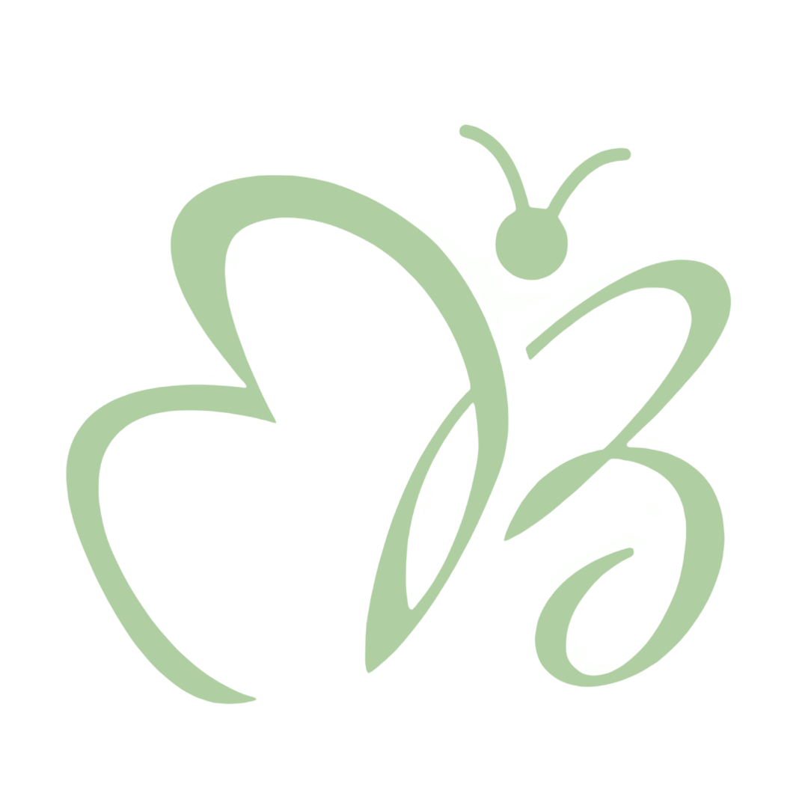

<div align="center">
  
</div>
<div align="center">
<h1> Biella Mariscotes
</h1>

  <a href="https://github.com/bmariscotes-strat/bmariscotes-mini-project-1/releases">
    
  <a href="https://biella-dev.vercel.app">
    
  </a>
</div>

#### ˚ʚ♡ɞ˚ ‎ [View Live Site](https://biella-dev.vercel.app)

Welcome to my personal developer portfolio! This project showcases selected web development projects, UI/UX designs, and personal experiments, highlighting my proficiency in modern web technologies.

<br>

## 📸 Overview

This portfolio was built to reflect both my technical skills and design sense through interactive, accessible, and thoughtfully crafted pages. It includes project showcases, an about section, and a contact form.

Key features:

- Project galleries with smooth animations
- Responsive, mobile-first design
- Loader and route-based transitions
- Contact/Leave a message form
- Accessible, clean UI using **shadcn/ui** components and **TailwindCSS**
- Optimized image handling with **Next.js Image**

<br>

## ⚙️ Tech Stack

| Category           | Tools / Libraries                                                                                                                  |
| :----------------- | :--------------------------------------------------------------------------------------------------------------------------------- |
| Frontend           | [Next.js](https://nextjs.org/), [React](https://reactjs.org/), [TypeScript](https://www.typescriptlang.org/)                       |
| Styling            | [Tailwind CSS](https://tailwindcss.com/), [shadcn/ui](https://ui.shadcn.dev/), [Lucide Icons](https://lucide.dev/)                 |
| Animations         | [Framer Motion](https://www.framer.com/motion/), [GSAP](https://greensock.com/gsap/), [Rough Notation](https://roughnotation.com/) |
| Fonts              | Google Fonts via `next/font`                                                                                                       |
| Forms & Validation | [Formspree](https://formspree.io/), Controlled Components, Custom Hooks                                                            |
| Hosting            | [Vercel](https://vercel.com/)                                                                                                      |

<br>

## 🗂️ Project Structure

```bash
.
├── components/
│   ├── layout/
│   ├── ui/
│   └── projects/
├── app/
│   ├── index.tsx
│   ├── about.tsx
│   ├── projects.tsx
│   └── contact.tsx
├── public/
│   ├── experience/
│   ├── status/
│   ├── system/
│   ├── ui/
├── styles/
├── lib/
└── README.md
```

<br>

<br>

## 🙌 Acknowledgements

- [shadcn/ui](https://ui.shadcn.dev/)
- [Lucide Icons](https://lucide.dev/)
- [Framer Motion](https://www.framer.com/motion/)
- [GSAP](https://greensock.com/gsap/)
- Fonts via [Google Fonts](https://fonts.google.com/)

<br>

## 📬 Contact

Want to collaborate or have feedback? Reach out via:

- 📧 [bm.mariscotes@gmail.com](mailto:your-email@gmail.com)
- 🌐 [LinkedIn](https://linkedin.com/in/biellamariscotes)
- 💻 [GitHub](https://github.com/biellamariscotes)

---

_© 2025 Biella Mariscotes. All rights reserved._

<hr>
